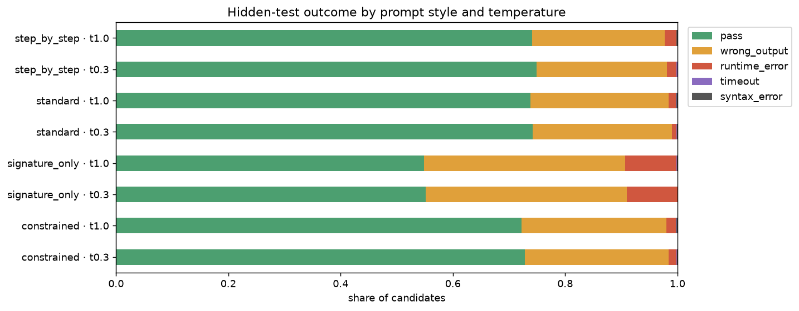
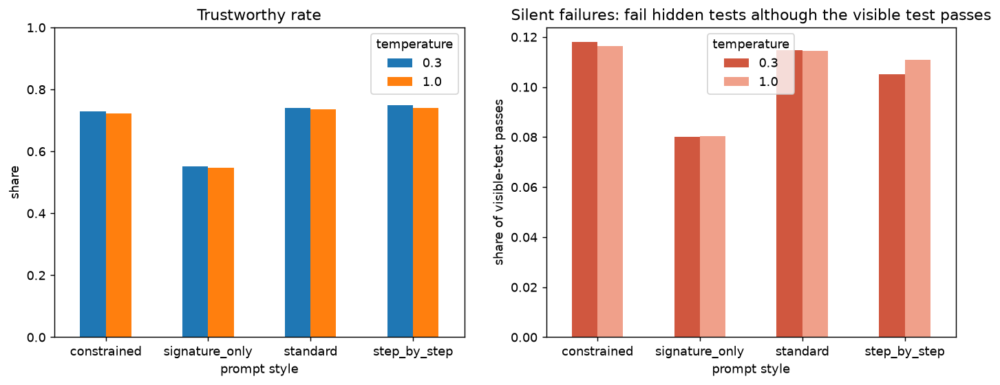
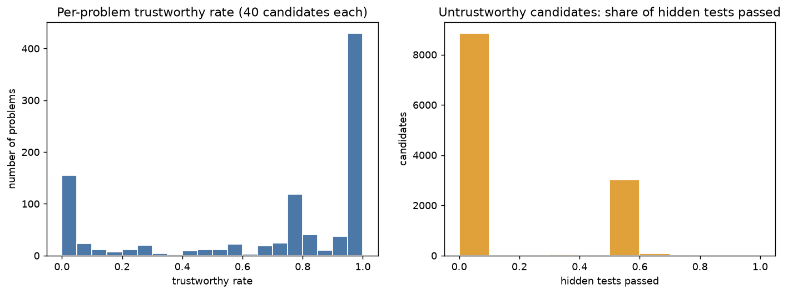
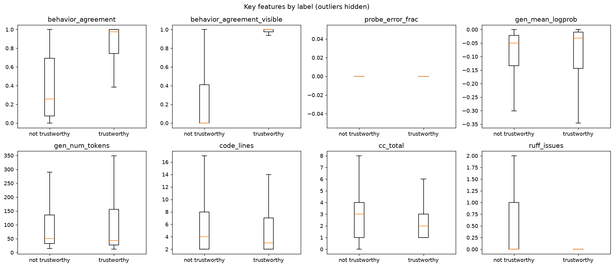
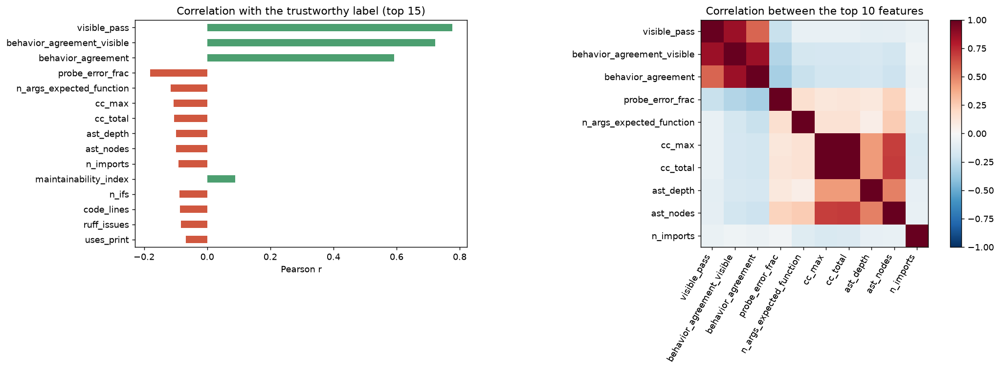
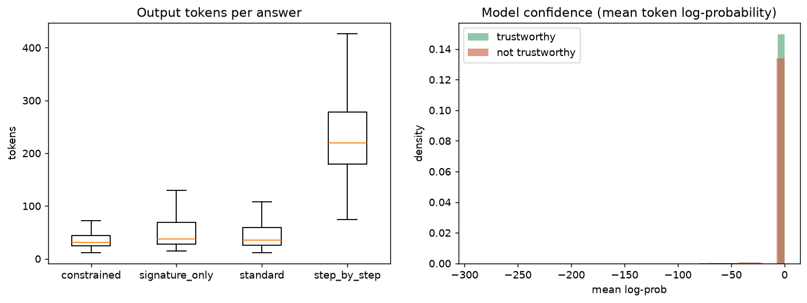
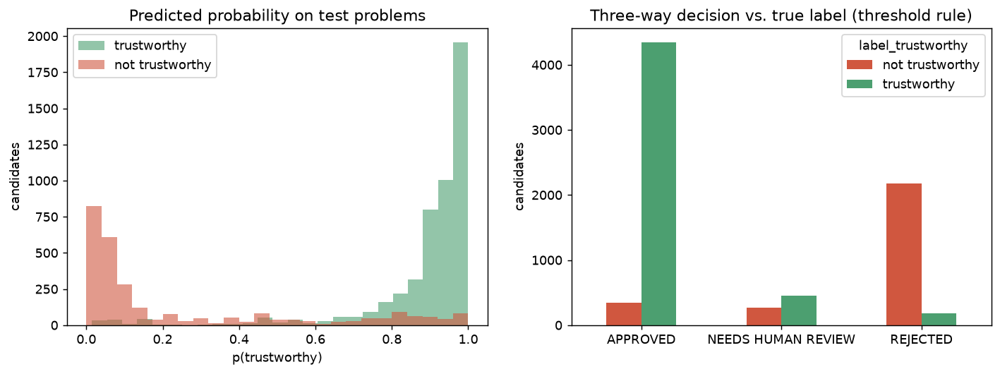
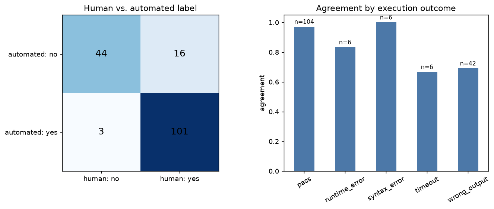

# Exploratory data analysis

38,720 natural candidates from 968 MBPP problems (2 model settings × 4 prompt styles). Figures are in `figures/eda/`.

## 1. Overview

- Trustworthy: **68.9%**
- Pass the visible test: 75.6%
- Pass the visible test but untrustworthy (hidden-test failure or security finding): **3,127** = 10.7% of visible passes

| outcome | rows | share |
|---|---|---|
| pass | 26720 | 0.690 |
| wrong_output | 10624 | 0.274 |
| runtime_error | 1301 | 0.034 |
| timeout | 39 | 0.001 |
| syntax_error | 36 | 0.001 |

## 2. By prompt style and temperature

| config | rows | trustworthy | visible_pass | mean_tokens |
|---|---|---|---|---|
| constrained · t0.3 | 4840 | 0.728 | 0.806 | 42.213 |
| constrained · t1.0 | 4840 | 0.722 | 0.800 | 42.116 |
| signature_only · t0.3 | 4840 | 0.551 | 0.589 | 56.086 |
| signature_only · t1.0 | 4840 | 0.547 | 0.584 | 56.757 |
| standard · t0.3 | 4840 | 0.740 | 0.820 | 50.592 |
| standard · t1.0 | 4840 | 0.737 | 0.815 | 51.182 |
| step_by_step · t0.3 | 4840 | 0.749 | 0.821 | 237.900 |
| step_by_step · t1.0 | 4840 | 0.741 | 0.815 | 239.892 |

## 3. Problems

Failures cluster by problem: most problems are either always or never solved.

| problem trust rate | problems |
|---|---|
| 0% (always fails) | 137 |
| 1–50% | 124 |
| 51–99% | 319 |
| 100% (always correct) | 388 |

Hardest problems that usually pass the visible test (silent-failure hot spots):

| task_id | trustworthy | visible_pass | problem |
|---|---|---|---|
| 963 | 0.000 | 0.750 | Write a function to calculate the discriminant value. |
| 5 | 0.000 | 0.900 | Write a function to find the number of ways to fill it with 2 x 1 dominoes for t |
| 483 | 0.000 | 1.000 | Write a python function to find the first natural number whose factorial is divi |
| 537 | 0.000 | 1.000 | Write a python function to find the first repeated word in a given string. |
| 515 | 0.000 | 0.950 | Write a function to check if there is a subset with sum divisible by m. |
| 482 | 0.000 | 0.750 | Write a function to find sequences of one upper case letter followed by lower ca |
| 433 | 0.000 | 0.750 | Write a function to check whether the entered number is greater than the element |
| 434 | 0.000 | 0.750 | Write a function that matches a string that has an a followed by one or more b's |
| 454 | 0.000 | 0.650 | Write a function that matches a word containing 'z'. |
| 523 | 0.000 | 0.675 | Write a function to check whether a given string has a capital letter, a lower c |

## 4. Error types in hidden tests

| error type | candidates |
|---|---|
| TypeError | 966 |
| ValueError | 113 |
| NameError | 52 |
| IndexError | 48 |
| AttributeError | 44 |
| KeyError | 21 |
| RecursionError | 11 |
| UnboundLocalError | 9 |
| StopIteration | 9 |
| ModuleNotFoundError | 8 |

## 5. Features

Correlation of each feature with the trustworthy label (top 15 by absolute value). Correlation is not the same as model importance; see `feature_importance.csv`.

| feature | r |
|---|---|
| visible_pass | 0.776 |
| behavior_agreement_visible | 0.722 |
| behavior_agreement | 0.593 |
| probe_error_frac | -0.181 |
| n_args_expected_function | -0.116 |
| cc_max | -0.106 |
| cc_total | -0.105 |
| ast_depth | -0.099 |
| ast_nodes | -0.098 |
| n_imports | -0.091 |
| maintainability_index | 0.088 |
| n_ifs | -0.087 |
| code_lines | -0.087 |
| ruff_issues | -0.083 |
| uses_print | -0.068 |

## 6. Model predictions on the test problems

| decision | not trustworthy | trustworthy | total |
|---|---|---|---|
| APPROVED | 345 | 4341 | 4686 |
| NEEDS HUMAN REVIEW | 272 | 448 | 720 |
| REJECTED | 2173 | 181 | 2354 |
| All | 2790 | 4970 | 7760 |

## 7. Human review

164 rows reviewed; agreement with the automated label 88.4%. Kappa is in `human_agreement.json`.

| exec_status | agreement | rows |
|---|---|---|
| pass | 0.971 | 104 |
| runtime_error | 0.833 | 6 |
| syntax_error | 1.000 | 6 |
| timeout | 0.667 | 6 |
| wrong_output | 0.690 | 42 |

